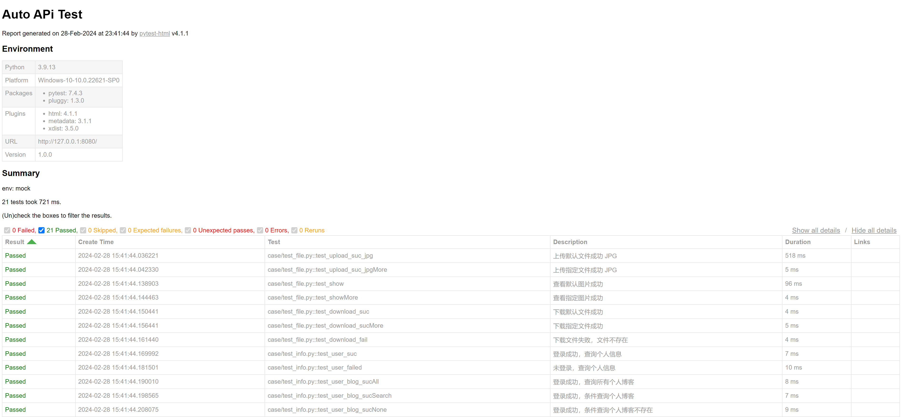

<!-- 接口自动化 -->

> ### 1. 项目结构


``` python
项目路径

├─case  # 测试用例
│  │  test_file.py
│  │  test_info.py
│  └─ test_login.py
│
├─common        # 工具类
│  └─ myLogger.py   # 日志类
│
├─log           # 日志
│      Log_2024-02-28 211735.log
│
├─report        # 测试报告
│      result.html
│
├─static        # 静态文件资源
│  ├─download   # 存放下载文件
│  │      other.jpg
│  │      pic.jpg
│  │
│  ├─downloadTo # 文件下载路径
│  └─upload     # 文件上传路径
│          other.jpg
│          pic.jpg
|
│  api.py       # falsk 模拟接口 
│  apiUser.py   # 封装接口类
│  conftest.py  # pytest 配置文件 
│  main.py      # 入口文件
|  pytest.ini   # pytest 配置文件
|  README.md
```


> ### 2. 模拟请求

?> 功能模块：登录注销、个人信息、文件操作


``` python
# api.py 

import uuid
from flask import *
import logging
import os
from datetime import *
from werkzeug.utils import secure_filename

# 注册 flask 实例
app = Flask(__name__)
# 解决中文乱码
app.json.ensure_ascii = False

# 设置 session
app.secret_key = os.urandom(24)
# 设置过期时间
app.permanent_session_lifetime = timedelta(days=7)


# 文件上传下载路径
app.config['UPLOAD_PATH'] = 'static/upload/'
app.config['DOWNLOAD_PATH'] = 'static/download/'
# 上传文件大小
app.config['MAX_CONTENT_LENGTH'] = 1 * 1024 * 1024
    
    
class api():

    """ 首页 """
    @app.route('/', methods=['GET'])
    def index():
        return {
            'transok': 0,
            'code': 200,
            'msg': '',
            'title': '首页',
            'data': 'Hello World!'
        }

    """ 个人信息 """

    @app.route('/user', methods=['GET'])
    def user():
        user = session.get('user')
        if user:
            logging.debug('用户登录成功')
            return jsonify(transok=0, code=200, msg='', title='个人信息', data={'username': user, 'gender': '0'})
        else:
            logging.warning('用户未登录')
            return {
                'transok': 1,
                'code': 203,
                'msg': '用户未登录'
            }

    """ 登录 """

    @app.route('/login', methods=['POST'])
    def login():
        user = request.form.get('user')
        pwd = request.form.get('pwd')
        if user and pwd:
            if user == 'test' and pwd == '123':
                # 保存 session
                session['user'] = 'test'
                # 延长有效期
                session.permanent = True
                logging.debug(session.get('user'))
                logging.debug('登录成功')
                return {
                    'transok': 0,
                    'code': 200,
                    'msg': '登录成功'
                }
            else:
                logging.debug('用户密码错误')
                return {
                    'transok': 1,
                    'code': 202,
                    'msg': '用户密码错误'
                }
        else:
            return {
                'transok': 1,
                'code': 201,
                'msg': '用户密码不能为空'
            }

    """ 注销 """

    @app.route('/logout', methods=['GET'])
    def logout():
        logging.debug(session)
        user = request.form.get('user')
        if session and user and session.get('user') == user:
            # session.pop('user')
            session.clear()
            logging.debug(session)
            logging.debug('用户已注销')
            return {
                'transok': 0,
                'code': 200,
                'msg': '用户已注销'
            }
        else:
            logging.debug('用户未登录')
            return {
                'transok': 1,
                'code': 203,
                'msg': '用户未登录'
            }

    """ 查询博客 """

    @app.route('/user/blog', methods=['GET'])
    def blog(title=None):
        user = session.get('user')
        title = request.form.get('title')
        logging.warning(title)
        dc = [{'title': '文章1', 'author': 'test', 'desc': '内容1'},
              {'title': '文章2', 'author': 'test', 'desc': '内容2'},
              {'title': '文章3', 'author': 'test', 'desc': '内容3'}]
        if user:
            if title == None:
                logging.debug('查询个人博客')
                return jsonify(transok=0, code=200, msg='', title='个人博客', count=3, data=dc)
            else:
                logging.debug('条件查询个人博客')
                ls = []
                for item in dc:
                    if item['title'] == title:
                        ls.append(item)
                if ls:
                    return jsonify(transok=0, code=200, msg='', title='个人博客', count=len(ls), data=ls)
                else:
                    return jsonify(transok=0, code=200, msg='查不到数据', title='个人博客', count=len(ls), data=ls)
        else:
            return {
                'transok': 1,
                'code': 203,
                'msg': '用户未登录'
            }


    """ 文件上传 """

    @app.route('/upload', methods=['GET', 'POST'])
    def upload():
        if (request.method == 'GET'):
            return render_template('upload.html')
        else:
            # file为上传表单的name属性值
            f = request.files['file']
            # 获取中文文件名
            fname = secure_filename(f.filename)
            # 获取文件格式
            ext = fname.split('.')[-1]
            # 以 uuid 作为文件名，拼接格式
            ffname = str(uuid.uuid4()) + "." + ext
            # 不存在路径则新建
            if not os.path.exists(app.config['UPLOAD_PATH']):
                os.makedirs(app.config['UPLOAD_PATH'])
            f.save(os.path.join(app.config['UPLOAD_PATH'], ffname))
            logging.debug(os.path.exists(os.path.join(
                app.config['UPLOAD_PATH'], ffname)))
            # 提交后，查看上传文件
            # return redirect(url_for('show', filename=ffname))
            return {
                'transok': 0,
                'code': 200,
                'msg': '文件上传成功'
            }

    """ 查看上传图片 """

    @app.route('/show/<filename>', methods=['GET'])
    def show(filename):
        # 查看文件
        return send_from_directory(app.config['UPLOAD_PATH'], filename)

    """ 文件下载 """

    @app.route('/download/<filename>', methods=['GET'])
    def download(filename):
        if request.method == "GET":
            # 判断文件是否存在
            path = os.path.isfile(os.path.join(
                app.config['DOWNLOAD_PATH'], filename))
            logging.warning(os.path.join(
                app.config['DOWNLOAD_PATH'], filename))
            if path:
                # as_attachment=True 作为附件下载
                return send_from_directory(app.config['DOWNLOAD_PATH'], filename, as_attachment=True)
            else:
                return {
                    'transok': 1,
                    'code': 201,
                    'msg': '文件不存在'
                }


if __name__ == '__main__':
    app.run(host='127.0.0.1', port=8080, debug=True)
```


> ### 3. 封装请求

?> 接口封装类：封装请求，减少重复代码，方便组装场景

``` python
# 封装前

def test_login_suc():
    logger.info('登录成功')
    data = {'user': 'test', 'pwd': '123'}
    resp = requests.post(url=base_url+'/login', data=data)
    dc = {
        'transok': 0,
        'code': 200,
        'msg': '登录成功'
    }
    assert resp.status_code == 200
    resp = resp.json()
    for key in dc.keys():
        assert dc[key] == resp[key]

# 封装后，减少重复代码

api = apiUser()

def test_login_suc():
    logger.info('登录成功')
    resp = api.login()
    for key in dc[0].keys():
        assert dc[0][key] == resp[key]

```

***

``` python
# apiUser.py

import os
import uuid
import requests
from common.myLogger import logger


''' 封装请求，提供给测试用例组装场景 
    data 为入参
    result 为期望结果，默认成功
    url 可切换为 Mock 接口或真实接口，前期调用模拟接口，等研发编码完成，切换为真实接口
'''

# base_url = 'http://127.0.0.1:6060/'
# base_url = '真实接口'

session = requests.Session()
data = {'user': 'test', 'pwd': '123'}
path = f'C:/Users/Z/Pictures/1.jpg'


class apiUser():

    """ 首页 """

    def index(self, base_url):
        logger.info(base_url)
        try:
            # 发送请求
            resp = requests.get(base_url)
            # 预期结果
            dc = {
                'transok': 0,
                'code': 200,
                'msg': '',
                'title': '首页',
                'data': 'Hello World!'
            }
            # 返回响应码
            assert resp.status_code == 200
            # 转换 json 格式
            resp = resp.json()

            # 逐个对比，预期结果和实际结果
            for key in dc.keys():
                assert dc[key] == resp[key]
            logger.info('Success {}'.format(resp))
            return True
        except:
            logger.error('Failed {}'.format(resp))
            return False

    """ 登录 """

    def login(self, base_url, user=data['user'], pwd=data['pwd']):
        logger.info(base_url+'login')
        req = {'user': user, 'pwd': pwd}
        try:
            resp = session.post(url=base_url+'login', data=req)
            assert resp.status_code == 200
            logger.info('Success {}'.format(resp.json()))
            return resp.json()
        except:
            logger.error('Failed {}'.format(resp.json()))
            return False

    """ 注销 """

    def logout(self, base_url, user=data['user']):
        logger.info(base_url+'logout')
        req = {'user': user}
        try:
            resp = session.get(url=base_url+'logout', data=req)
            assert resp.status_code == 200
            logger.info('Success {}'.format(resp.json()))
            return resp.json()
        except:
            logger.error('Failed {}'.format(resp.json()))
            return False

    def loginOut(self, base_url, user=data['user'], pwd=data['pwd']):
        req1 = {'user': user, 'pwd': pwd}
        req2 = {'user': user}
        try:
            session = requests.session()
            session.post(url=base_url+'login', data=req1)
            logger.info(session.cookies)
            resp = session.get(url=base_url+'logout', data=req2)
            logger.info(resp.cookies.get_dict)
            assert resp.status_code == 200
            return resp.json()
        except:
            return False

    """ 查询个人信息 """

    def userInfo(self, base_url):
        logger.info(base_url+'user')
        try:
            resp = session.get(url=base_url+'user')
            assert resp.status_code == 200
            logger.info('Success {}'.format(resp.json()))
            return resp.json()
        except:
            logger.error('Failed {}'.format(resp.json()))
            return False

    """ 查询个人博客 """

    def userBlog(self, base_url, title=None):
        logger.info(base_url+'user/blog')
        req = {'title': title}
        try:
            resp = session.get(url=base_url+'user/blog', data=req)
            assert resp.status_code == 200
            logger.info('Success {}'.format(resp.json()))
            return resp.json()
        except:
            logger.error('Failed {}'.format(resp.json()))
            return False

    """ 上传文件 """

    def upload(self, base_url, file=path):
        logger.info(base_url+'upload')
        req = {'file': ('file.jpg', open(file, 'rb'), 'image/jpg')}
        try:
            resp = session.post(url=base_url+'upload', files=req)
            assert resp.status_code == 200
            logger.info('Success {}'.format(resp.json()))
            return resp.json()
        except:
            logger.error('Failed {}'.format(resp.json()))
            return False

    """ 查看上传文件 """

    def show(self, base_url, file='pic.jpg'):
        logger.info(base_url+'show/'+file)
        try:
            resp = session.get(url=base_url+'show/'+file)
            assert resp.status_code == 200
            logger.info('Success True')
            return True
        except:
            logger.error('Failed False')
            return False

    """ 下载文件 """

    def download(self, base_url, file='pic.jpg'):
        logger.info(base_url+'download/'+file)
        try:
            resp = session.get(url=base_url+'download/'+file)
            assert resp.status_code == 200
            path = f'static/downloadTo/'
            if not os.path.exists(path):
                os.makedirs(path)
            file = os.path.join(path, str(uuid.uuid4()) + ".jpg")
            with open(file, 'wb') as f:
                f.write(resp.content)
            logger.info('Success True')
            return True
        except:
            logger.error('Failed False')
            return False


if __name__ == '__main__':
    api = apiUser()
    api.login()
    api.logout()
    api.loginOut()
    api.userInfo()
    api.userBlog()
    api.userBlog(title='文章4')
    # print(result)
    result = api.upload()
    print(result)
    result = api.download('other.jpg')
    print(result)
    # result = api.show()
    # print(result)
```

> ### 4. 组装场景

?> 测试用例文件：test_login（登录注销）、test_info（个人信息）、test_file（文件操作）

> #### 组装登录注销

``` python
# test_login.py

from apiUser import apiUser
from common.myLogger import logger


api = apiUser()
# base_url = 'http://127.0.0.1:8080'

# 期望结果
dc = [{
    'transok': 0,
    'code': 200,
    'msg': '登录成功'
}, {
    'transok': 1,
    'code': 202,
    'msg': '用户密码错误'
}, {
    'transok': 1,
    'code': 201,
    'msg': '用户密码不能为空'
}, {
    'transok': 1,
    'code': 203,
    'msg': '用户未登录'
}, {
    'transok': 0,
    'code': 200,
    'msg': '用户已注销'
}]


def test_index(base_url):
    """ 访问首页 """
    logger.info('访问首页')
    resp = api.index(base_url)
    assert resp


def test_login_suc(base_url):
    """ 登录成功 """
    logger.info('登录成功')
    resp = api.login(base_url)
    for key in dc[0].keys():
        assert dc[0][key] == resp[key]


def test_login_failed1(base_url):
    """ 登录失败，用户为空 """
    logger.info('登录失败，用户为空')
    resp = api.login(base_url, user='')
    for key in dc[2].keys():
        assert dc[2][key] == resp[key]


def test_login_failed2(base_url):
    """ 登录失败，密码为空 """
    logger.info('登录失败，密码为空')
    resp = api.login(base_url, pwd='')
    for key in dc[2].keys():
        assert dc[2][key] == resp[key]


def test_login_failed3(base_url):
    """ 登录失败，用户不存在 """
    logger.info('登录失败，用户不存在')
    resp = api.login(base_url, user='admin')
    for key in dc[1].keys():
        assert dc[1][key] == resp[key]


def test_login_failed4(base_url):
    """ 登录失败，密码错误 """
    logger.info('登录失败，用户不存在')
    resp = api.login(base_url, pwd='456')
    for key in dc[1].keys():
        assert dc[1][key] == resp[key]


def test_logout_suc(base_url):
    """ 本人，注销成功 """
    logger.info('本人，注销成功')
    # 登录成功
    api.login(base_url)
    # 注销失败
    resp = api.logout(base_url)
    for key in dc[4].keys():
        assert dc[4][key] == resp[key]


def test_logout_failed(base_url):
    """ 非本人，注销失败 """
    logger.info('非本人，注销成功')
    # 登录成功
    api.login(base_url)
    # 注销失败
    resp = api.logout(base_url, user='admin')
    for key in dc[3].keys():
        assert dc[3][key] == resp[key]
```

***

> #### 组装个人信息

``` python
# test_info.py

from apiUser import apiUser
from common.myLogger import logger

api = apiUser()
# base_url = 'http://127.0.0.1:8080'

# 期望结果
dc = [{
    'transok': 0,
    'code': 200,
    'msg': '',
    'title': '个人信息',
    'data': {'username': 'test', 'gender': '0'}
}, {
    'transok': 1,
    'code': 203,
    'msg': '用户未登录'
}, {
    'transok': 0,
    'code': 200,
    'msg': '',
    'title': '个人博客',
    'count': 3,
    'data': [{'title': '文章1', 'author': 'test', 'desc': '内容1'},
             {'title': '文章2', 'author': 'test', 'desc': '内容2'},
             {'title': '文章3', 'author': 'test', 'desc': '内容3'}]
}, {
    'transok': 0,
    'code': 200,
    'msg': '',
    'title': '个人博客',
    'count': 1,
    'data': [{'title': '文章2', 'author': 'test', 'desc': '内容2'}]
}, {
    'transok': 0,
    'code': 200,
    'msg': '查不到数据',
    'title': '个人博客',
    'count': 0,
    'data': []
}, {
    'transok': 1,
    'code': 203,
    'msg': '用户未登录'
}
]


def test_user_suc(base_url):
    """ 登录成功，查询个人信息 """
    logger.info('登录成功，查询个人信息')
    # 登录成功
    api.login(base_url)
    # 查询个人信息
    resp = api.userInfo(base_url)
    for key in dc[0].keys():
        assert dc[0][key] == resp[key]


def test_user_failed(base_url):
    """ 未登录，查询个人信息 """
    logger.info('未登录，查询个人信息')
    # 登录注销，处于未登录状态
    api.login(base_url)
    api.logout(base_url)
    # 查询个人信息
    resp = api.userInfo(base_url)
    for key in dc[1].keys():
        assert dc[1][key] == resp[key]


def test_user_blog_sucAll(base_url):
    """ 登录成功，查询所有个人博客 """
    logger.info('登录成功，查询所有个人博客')
    # 登录成功
    api.login(base_url)
    # 查询所有个人博客
    resp = api.userBlog(base_url)
    for key in dc[2].keys():
        assert dc[2][key] == resp[key]


def test_user_blog_sucSearch(base_url):
    """ 登录成功，条件查询个人博客 """
    logger.info('登录成功，条件查询个人博客')
    # 登录成功
    api.login(base_url)
    # 条件查询个人博客
    resp = api.userBlog(base_url, title='文章2')
    for key in dc[3].keys():
        assert dc[3][key] == resp[key]


def test_user_blog_sucNone(base_url):
    """ 登录成功，条件查询个人博客不存在 """
    logger.info('登录成功，条件查询个人博客不存在')
    # 登录成功
    api.login(base_url)
    # 条件查询个人博客
    resp = api.userBlog(base_url, title='123')
    for key in dc[4].keys():
        assert dc[4][key] == resp[key]


def test_user_blog_failed(base_url):
    """ 未登录，查询个人博客 """
    logger.info('未登录，查询个人博客')
    # 登录注销，处于未登录状态
    api.login(base_url)
    api.logout(base_url)
    # 条件查询个人博客
    resp = api.userBlog(base_url)
    for key in dc[5].keys():
        assert dc[5][key] == resp[key]
```

***

> #### 组装文件操作

``` python
# test_file.py

from apiUser import apiUser
from common.myLogger import logger

api = apiUser()
base_url = 'http://127.0.0.1:8080'

# 期望结果
dc = [{
    'transok': 0,
    'code': 200,
    'msg': '文件上传成功'
}]


def test_upload_suc_jpg(base_url):
    """ 上传默认文件成功 JPG """
    logger.info('上传默认文件成功 JPG')
    # 上传图片
    resp = api.upload(base_url)
    for key in dc[0].keys():
        assert dc[0][key] == resp[key]


def test_upload_suc_jpgMore(base_url):
    """ 上传指定文件成功 JPG """
    logger.info('上传指定文件成功 JPG')
    path = f'C:/Users/Z/Pictures/2.jpg'
    # 上传图片
    resp = api.upload(base_url, file=path)
    for key in dc[0].keys():
        assert dc[0][key] == resp[key]


""" 上传文件成功 PNG """

""" 上传文件失败，格式错误 """

""" 上传文件失败，文件过大 """


def test_show(base_url):
    """ 查看默认图片成功 """
    logger.info('查看默认图片成功')
    # 查看图片
    api.upload(base_url)
    resp = api.show(base_url)
    assert resp


def test_showMore(base_url):
    """ 查看指定图片成功 """
    logger.info('查看指定图片成功')
    file = 'other.jpg'
    # 查看图片
    resp = api.show(base_url, file)
    assert resp


def test_download_suc(base_url):
    """ 下载默认文件成功 """
    logger.info('下载默认文件成功')
    # 下载图片
    resp = api.download(base_url)
    assert resp


def test_download_sucMore(base_url):
    """ 下载指定文件成功 """
    logger.info('下载指定文件成功')
    file = 'other.jpg'
    # 下载图片
    resp = api.download(base_url, file)
    assert resp


def test_download_fail(base_url):
    """ 下载文件失败，文件不存在 """
    logger.info('下载文件失败，文件不存在')
    file = 'hhh.jpg'
    # 下载图片
    resp = api.download(base_url, file)
    assert resp
```


> ### 4. conftest

``` python
# conftest.py

from datetime import datetime
import subprocess
from pytest_metadata.plugin import metadata_key
import pytest


def pytest_addoption(parser):
    # 自定义环境参数，添加到配置对象
    # 默认测试环境 test，其他环境：模拟环境 mock、生产环境 pro
    # mock 模拟环境，即代码尚未完成时，测试 mock 的 API
    # test 测试环境，指代码完成后，正式测试的 API
    parser.addoption('--env', action='store', default='test',
                     help='环境参数：mock-模拟环境、test-测试环境、pro-生产环境')


@pytest.fixture(scope="session", autouse=True)
def env(request):
    # 从配置对象，读取自定义参数的值
    # pytest --env=mcok 运行时，获取参数值 mock
    yield request.config.getoption('--env')


@pytest.fixture(scope="session", autouse=True)
def base_url(env):

    dc = ['http://127.0.0.1:8080/',
          'http://127.0.0.1:6060/', 'http://127.0.0.1:7070/']

    # 按 env 切换到不同环境的 url
    if env == 'mock':
        # 启动本地 falsk 接口
        subprocess.Popen('python api.py')
        base_url = dc[0]
    elif env == 'pro':
        base_url = dc[1]
    else:
        base_url = dc[2]

    # with open('./data/settings.py', 'r') as f:
    #     ff = f.readlines()

    # 统一修改配置 settings
    # with open('./data/settings.py', 'w') as f:
    #     ff[0] = f'base_url = "{base_url}"\n'
    #     f.writelines(ff)
    #     f.flush()

    return base_url


""" pytest-html """


# 编辑报告标题

def pytest_html_report_title(report):
    report.title = "Auto APi Test"


# 编辑测试内容
def pytest_configure(config):
    config.stash[metadata_key]["URL"] = "http://127.0.0.1:8080/"


@pytest.hookimpl(tryfirst=True)
def pytest_sessionfinish(session, exitstatus):
    session.config.stash[metadata_key]["Version"] = "1.0.0"


def pytest_html_results_summary(prefix, summary, postfix):
    prefix.extend(["<p>env: mock</p>"])


# 编辑测试表格
def pytest_html_results_table_header(cells):
    cells.insert(2, "<th>Description</th>")
    cells.insert(
        1, '<th class="sortable time" data-column-type="time">Create Time</th>')


def pytest_html_results_table_row(report, cells):
    cells.insert(2, f"<td>{report.description}</td>")
    cells.insert(1, f'<td class="col-time">{datetime.utcnow()}</td>')


@pytest.hookimpl(hookwrapper=True)
def pytest_runtest_makereport(item, call):
    outcome = yield
    report = outcome.get_result()
    report.description = str(item.function.__doc__)
```

> ### 5. pytest.ini


``` python
[pytest]

; 注册标记
markers = 
    a : a
    b : b
    login : run login mark case

; 命令行参数
; pytest 运行，自动带以下参数
addopts = --env=mock --maxfail=3 --color=yes --tb=no --disable-warnings -vs --html=./report/result.html --self-contained-html --log-cli-level=DEBUG
; --log-cli-level=ERROR 
; --show-capture=no 不显示 live log call，'no', 'stdout', 'stderr', 'log', 'all'
; --junitxml=./result.xml

generate_report_on_test = True

; 折叠 passed,skipped,failed,error,xfailed,xpassed,rerun
render_collapsed = passed,skipped,xfailed,xpassed,rerun

; 忽略某些目录，不做遍历
norecursedirs = src report util log

; 测试路径
testpaths = ./case

; 测试文件
python_files = test*.py *test.py

; 测试类
python_classes = Test*

; 测试方法
python_functions = test_*

; 更详细的控制台日志
log_cli = false
log_file = ./log/Log_pytest.log

; 设置日志级别
log_cli_level = DEBUG

; 设置日志日期格式
log_cli_date_format = %Y-%m-%d %H:%M:%S

; 设置日志消息格式
log_cli_format = %(asctime)s %(filename)s %(funcName)s [line- %(lineno)d] %(levelname)s %(message)s

; 开启，xpassed 归到 failed
xfail_strict = false
```


> ### 6. 入口文件

?> 入口文件作用：启动 pytest，运行测试用例，生成日志和测试报告，停止 flask 服务。

``` python
# main.py

import os
import sys
import pytest

port = '8080'


if __name__ == '__main__':

    """ 运行 pytest """ 
    
    code = pytest.main()
    
    """ 停止 flask 服务 """
    
    r = os.popen("netstat -ano | findstr " + port)
    ls = r.read().split("\n")
    print("进程个数为：", len(ls)-1)

    for i in ls:
        j = i.split(" ")
        if len(j) > 1:
            pid = j[len(j)-1]
            print('端口：' + pid)
            os.system("taskkill /PID "+pid+" /T /F")
    r.close()

    """ 结束 """

    print(f'案例执行完成，退出码：{code}')
    sys.exit(code)

```

> ### 7. 生成日志

?> 重写日志类 logging

``` python
# myLogger.py   

import os
import time
import logging
from logging.handlers import RotatingFileHandler


class MyLogger(logging.Logger):

    """ 重写日志初始化 """

    def __init__(self, level='DEBUG'):

        # 继承原 logger 初始化
        super().__init__('mylog')

        # 格式化
        fmt = '%(asctime)s %(filename)s %(funcName)s [line- %(lineno)d] %(levelname)s %(message)s'
        format = logging.Formatter(fmt)

        # 控制台打印
        console = logging.StreamHandler()
        # 设置处理日志等级
        console.setLevel(level)
        # 设置日志格式
        console.setFormatter(format)
        # 添加 Handler 处理器
        self.addHandler(console)

        # 定义日志
        if not os.path.exists('log'):
            os.makedirs('log')
        date = time.strftime(
            'Log_%Y-%m-%d %H%M%S', time.localtime(time.time()))
        file = f'log/{date}.log'

        # 日志打印
        # 定义路径、编码、最大（10M）、切割保留数量（1）
        log = RotatingFileHandler(
            file, encoding='UTF-8', maxBytes=1024*1024*10, backupCount=1)
        # 设置处理日志等级
        log.setLevel(level)
        # 设置日志格式
        log.setFormatter(format)
        # 添加 Handler 处理器
        self.addHandler(log)


logger = MyLogger()
```
```
# Log_2024-02-28 225732.log

2024-02-28 22:57:32,986 test_login.py test_login_suc [line- 43] INFO 登录成功
2024-02-28 22:57:32,986 apiUser.py login [line- 55] INFO http://127.0.0.1:8080/login
2024-02-28 22:57:32,990 apiUser.py login [line- 60] INFO Success {'code': 200, 'msg': '登录成功', 'transok': 0}
2024-02-28 22:57:32,992 test_login.py test_login_failed1 [line- 51] INFO 登录失败，用户为空
2024-02-28 22:57:32,992 apiUser.py login [line- 55] INFO http://127.0.0.1:8080/login
2024-02-28 22:57:32,996 apiUser.py login [line- 60] INFO Success {'code': 201, 'msg': '用户密码不能为空', 'transok': 1}
2024-02-28 22:57:32,998 test_login.py test_login_failed2 [line- 59] INFO 登录失败，密码为空
2024-02-28 22:57:32,998 apiUser.py login [line- 55] INFO http://127.0.0.1:8080/login
2024-02-28 22:57:33,001 apiUser.py login [line- 60] INFO Success {'code': 201, 'msg': '用户密码不能为空', 'transok': 1}
2024-02-28 22:57:33,003 test_login.py test_login_failed3 [line- 67] INFO 登录失败，用户不存在
2024-02-28 22:57:33,003 apiUser.py login [line- 55] INFO http://127.0.0.1:8080/login
2024-02-28 22:57:33,007 apiUser.py login [line- 60] INFO Success {'code': 202, 'msg': '用户密码错误', 'transok': 1}
2024-02-28 22:57:33,009 test_login.py test_login_failed4 [line- 75] INFO 登录失败，用户不存在
2024-02-28 22:57:33,009 apiUser.py login [line- 55] INFO http://127.0.0.1:8080/login
2024-02-28 22:57:33,012 apiUser.py login [line- 60] INFO Success {'code': 202, 'msg': '用户密码错误', 'transok': 1}
```


> ### 8. 生成报告

pytest-html 测试报告：<a href='./_media/resource/result.html' target='blank'>Click Here</a> 


