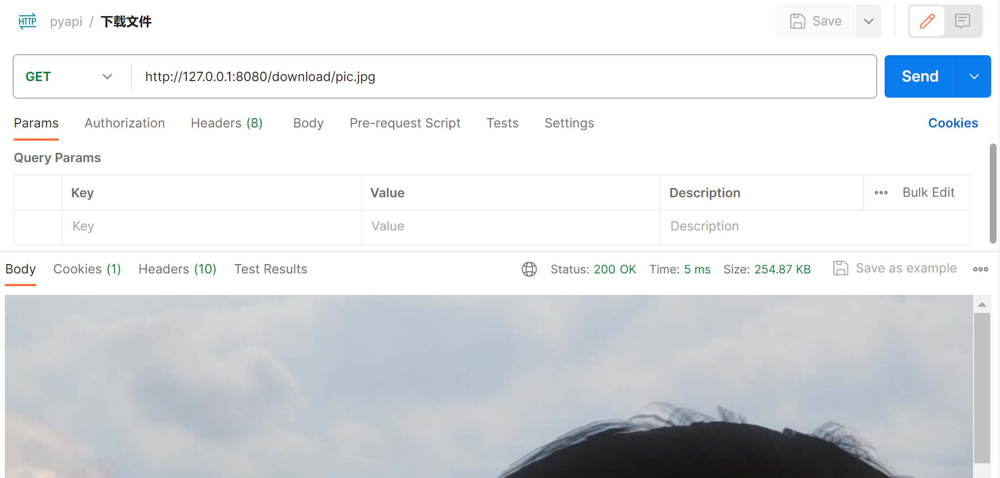

<!-- flask -->

> ### 1. 应用场景

?> 自动化测试中，flask 主要用于补齐的场景，作为临时方法，替换未实现的代码，自动化与研发编码并行。 
<br>
这里简单介绍，如何运用 flask 模拟临时接口，更深入的内容不做赘述。 <br>
<br>
桩，指替换代码 <br>
打桩，编写替换代码 <br>
<br>
打桩特性： <br>
控制，满足测试前置，使其走到下一步 <br>
隔离，使某些方法独立运行，不受其他因素影响 <br>
补齐，作为临时方法，替换未实现的代码，自动化与研发编码并行 <br>


> ### 2. 示例参考

?> 模拟场景：访问首页、登录、注销、个人信息、个人博客、文件上传、文件下载、查看文件 <br>
测试工具：PostMan、Chrome  查看模拟接口返回 <br>
模拟接口：api.py <br>
<br>
pip install flask <br>
flask run 或 python api.py <br>
<br>
set FLASK_APP=api.py <br>
flask run


``` python
# 模板

from flask import *
from werkzeug.utils import secure_filename

# 注册 flask 实例
app = Flask(__name__)
# 解决中文乱码
app.json.ensure_ascii = False

# 设置 session
app.secret_key = os.urandom(24)
# 设置过期时间
app.permanent_session_lifetime = timedelta(days=7)


class api():

    # 请求路径、请求方法
    @app.route('/', methods=['GET','POST'])
    ...


if __name__ == '__main__':
    # debug=True  调试模式-热启动
    # port 默认 5000
    app.run(host, port, debug, options)     


# 返参 json 格式化，jsonify
# python 原生的 request、response
# flask 模拟的 request、response、session、cookie
```

!> 运行时报错 Error: Could not locate a Flask application. <br>
<br>
设置 flask 运行文件 <br>
set FLASK_APP=api.py <br>
falsk run <br>


> ### 3. 访问首页


``` python
# api.py

from flask import *
import logging

# 注册 flask 实例
app = Flask(__name__)
# 解决中文乱码
app.json.ensure_ascii = False


class api():

    """ 首页 """
    @app.route('/', methods=['GET'])
    def index():
        return {
            'transok': 0,
            'code': 200,
            'msg': '',
            'title': '首页',
            'data': 'Hello World!'
        }
        # return jsonify(transok=0, code=200, msg='', title='首页', data='Hello World!')

if __name__ == '__main__':
    app.run(host='127.0.0.1', port=8080, debug=True)
```
```
python api.py

 * Serving Flask app 'api'
 * Debug mode: on
 * Running on http://127.0.0.1:8080

127.0.0.1 - - [28/Feb/2024 06:46:26] "GET / HTTP/1.1" 200 -
```


> ### 4. 登录注销

?> 模拟场景：登录成功、登录失败、注销成功、注销失败 <br>
<br>
账号密码 test / 123 <br>
判断账号密码部分，更深入的写法是，连接数据库做校验 <br>
<br>
设置 session <br>
app.secret_key = os.urandom(24) <br>
设置过期时间 <br>
app.permanent_session_lifetime = timedelta(days=7) <br>
<br>
保存 session <br>
session['user'] = 'test' <br>
延长有效期 <br>
session.permanent = True <br>
<br>
清理某个 session <br>
session.pop('user') <br>
清理所有 session <br>
session.clear() <br>


``` python
from flask import *
import logging
import os
from datetime import *
from werkzeug.utils import secure_filename

# 注册 flask 实例
app = Flask(__name__)
# 解决中文乱码
app.json.ensure_ascii = False

# 设置 session
app.secret_key = os.urandom(24)
# 设置过期时间
app.permanent_session_lifetime = timedelta(days=7)


class api():

    """ 登录 """

    @app.route('/login', methods=['POST'])
    def login():
        user = request.form.get('user')
        pwd = request.form.get('pwd')
        if user and pwd:
            if user == 'test' and pwd == '123':
                # 保存 session
                session['user'] = 'test'
                # 延长有效期
                session.permanent = True
                print(session.get('user'))
                logging.info('登录成功')
                return {
                    'transok': 0,
                    'code': 200,
                    'msg': '登录成功'
                }
            else:
                logging.info('用户密码错误')
                return {
                    'transok': 1,
                    'code': 202,
                    'msg': '用户密码错误'
                }
        else:
            return {
                'transok': 1,
                'code': 201,
                'msg': '用户密码不能为空'
            }

    """ 注销 """

    @app.route('/logout', methods=['GET'])
    def logout():
        print(session)
        user = request.form.get('user')
        if session and user and session.get('user') == user:
            # session.pop('user')
            session.clear()
            print(session)
            logging.info('用户已注销')
            return {
                'transok': 0,
                'code': 200,
                'msg': '用户已注销'
            }
        else:
            logging.info('用户未登录')
            return {
                'transok': 1,
                'code': 203,
                'msg': '用户未登录'
            }


if __name__ == '__main__':
    app.run(host='127.0.0.1', port=8080, debug=True)

```
```
test
127.0.0.1 - - [28/Feb/2024 07:02:28] "POST /login HTTP/1.1" 200 -

<SecureCookieSession {'_permanent': True, 'user': 'test'}>
<SecureCookieSession {}>
127.0.0.1 - - [28/Feb/2024 07:04:22] "GET /logout HTTP/1.1" 200 -
```


> ### 5. 个人信息

?> 模拟场景：有无权限访问个人信息 


``` python
class api():

    @app.route('/user', methods=['GET'])
    def user():
        user = session.get('user')
        if user:
            logging.info('用户登录成功')
            return jsonify(transok=0, code=200, msg='', title='个人信息', data={'username': user, 'gender': '0'})
        else:
            logging.warning('用户未登录')
            return {
                'transok': 1,
                'code': 203,
                'msg': '用户未登录'
            }
```
```
WARNING:root:用户未登录
127.0.0.1 - - [28/Feb/2024 07:14:26] "GET /user HTTP/1.1" 200 -

test
127.0.0.1 - - [28/Feb/2024 07:15:03] "POST /login HTTP/1.1" 200 -
127.0.0.1 - - [28/Feb/2024 07:15:05] "GET /user HTTP/1.1" 200 -
```


> ### 6. 个人博客

?> 模拟场景：查询所有个人博客、条件查询个人博客 


``` python
class api():

    """ 查询博客 """

    @app.route('/user/blog', methods=['GET'])
    def blog(title=None):
        user = session.get('user')
        title = request.form.get('title')
        logging.warning(title)
        dc = [{'title': '文章1', 'author': 'test', 'desc': '内容1'},
              {'title': '文章2', 'author': 'test', 'desc': '内容2'},
              {'title': '文章3', 'author': 'test', 'desc': '内容3'}]
        if user:
            if title == None:
                logging.info('查询个人博客')
                return jsonify(transok=0, code=200, msg='', title='个人博客', count=3, data=dc)
            else:
                logging.info('条件查询个人博客')
                ls = []
                for item in dc:
                    if item['title'] == title:
                        ls.append(item)
                if ls:
                    return jsonify(transok=0, code=200, msg='', title='个人博客', count=len(ls), data=ls)
                else:
                    return jsonify(transok=0, code=200, msg='查不到数据', title='个人博客', count=len(ls), data=ls)
        else:
            return {
                'transok': 1,
                'code': 203,
                'msg': '用户未登录'
            }
```
```
WARNING:root:文章3
127.0.0.1 - - [28/Feb/2024 07:20:59] "GET /user/blog HTTP/1.1" 200 -
```


> ### 7. 上传文件 

?> 模拟场景：上传文件，设置文件路径、大小、命名 <br>
<br>
uuid 命名文件，上传到 static/upload/ <br>


``` python
import uuid
from flask import *
import logging
import os
from datetime import *
from werkzeug.utils import secure_filename

# 文件上传下载路径
app.config['UPLOAD_PATH'] = 'static/upload/'
app.config['DOWNLOAD_PATH'] = 'static/download/'
# 上传文件大小
app.config['MAX_CONTENT_LENGTH'] = 1 * 1024 * 1024


class api():

    """ 文件上传 """

    @app.route('/upload', methods=['GET', 'POST'])
    def upload():
        if (request.method == 'GET'):
            return render_template('upload.html')
        else:
            # file为上传表单的name属性值
            f = request.files['file']
            # 获取中文文件名
            fname = secure_filename(f.filename)
            # 获取文件格式
            ext = fname.split('.')[-1]
            # 以 uuid 作为文件名，拼接格式
            ffname = str(uuid.uuid4()) + "." + ext
            # 不存在路径则新建
            if not os.path.exists(app.config['UPLOAD_PATH']):
                os.makedirs(app.config['UPLOAD_PATH'])
            f.save(os.path.join(app.config['UPLOAD_PATH'], ffname))
            print(os.path.exists(os.path.join(
                app.config['UPLOAD_PATH'], ffname)))
            # 提交后，查看上传文件
            # return redirect(url_for('show', filename=ffname))
            return {
                'transok': 0,
                'code': 200,
                'msg': '文件上传成功'
            }
```
```
True
127.0.0.1 - - [28/Feb/2024 07:35:46] "POST /upload HTTP/1.1" 200 -
```

***

> #### 简单上传页面

?> GET 访问上传页面，POST 点击上传文件 <br>
templates / upload.html


``` html
<!DOCTYPE html>
<html lang="en">
<head>
    <meta charset="UTF-8">
    <title>上传图片</title>
</head>
<body>
    <form action="upload" method="POST" enctype="multipart/form-data">
        <h1>上传文件</h1>
        <input type="file" name="file" accept=".jpg, .png" /><p>
        <input type="submit" />
    </form>
</body>
</html>
```


> ### 8. 下载文件 

?> 模拟场景：下载文件，设置文件查询路径 <br>
<br>
static/download/ 下存放一张 pic.jpg <br>



``` python
# 文件上传下载路径
app.config['UPLOAD_PATH'] = 'static/upload/'
app.config['DOWNLOAD_PATH'] = 'static/download/'
# 上传文件大小
app.config['MAX_CONTENT_LENGTH'] = 1 * 1024 * 1024


class api():

    """ 文件下载 """

    @app.route('/download/<filename>', methods=['GET'])
    def download(filename):
        if request.method == "GET":
            # 判断文件是否存在
            path = os.path.isfile(os.path.join(
                app.config['DOWNLOAD_PATH'], filename))
            logging.warning(os.path.join(
                app.config['DOWNLOAD_PATH'], filename))
            if path:
                # as_attachment=True 作为附件下载
                return send_from_directory(app.config['DOWNLOAD_PATH'], filename, as_attachment=True)
            else:
                return {
                    'transok': 1,
                    'code': 201,
                    'msg': '文件不存在'
                }
```
```
WARNING:root:static/download/pic.jpg
127.0.0.1 - - [28/Feb/2024 07:46:47] "GET /download/pic.jpg HTTP/1.1" 200 -
```

> ### 9. 查看文件 

?> 模拟场景：查看文件，设置文件查询路径 <br>
<br>
static/upload/ 下存放一张 pic.jpg <br>


``` python
# 文件上传下载路径
app.config['UPLOAD_PATH'] = 'static/upload/'
app.config['DOWNLOAD_PATH'] = 'static/download/'
# 上传文件大小
app.config['MAX_CONTENT_LENGTH'] = 1 * 1024 * 1024


class api():

    """ 查看上传图片 """

    @app.route('/show/<filename>', methods=['GET'])
    def show(filename):
        # 查看文件
        return send_from_directory(app.config['UPLOAD_PATH'], filename)
```
```
127.0.0.1 - - [28/Feb/2024 08:01:27] "GET /show/pic.jpg HTTP/1.1" 200 -
```

