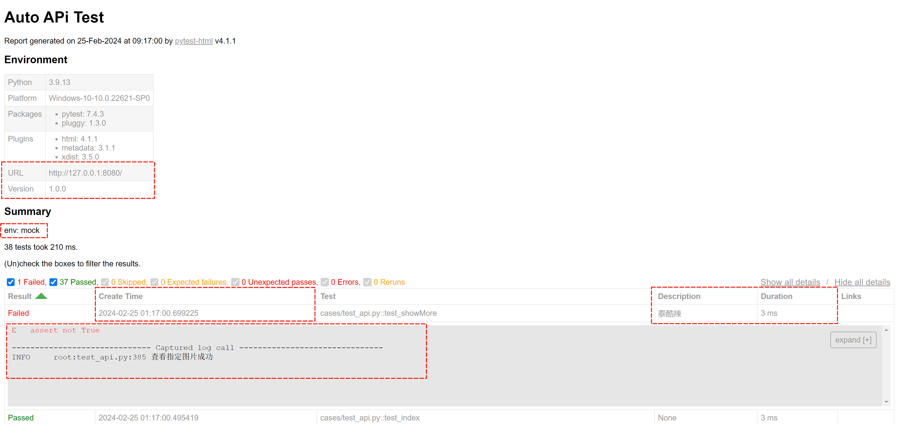

<!-- pytest-html -->

> ### 1. Pytest_html 入门

?> pytest-html 是一个简单的测试报告框架，支持 pytest 配置文件设置 <br>
<br>
pip install pytest-html <br>
<br>
生成测试报告 <br>
html + 样式：pytest --html=./report.html <br>
html 和样式合一：pytest --html=./report.html --self-contained-html <br>


> ### 2. 示例参考

?> 修改配置文件 pytest.ini、conftest.py <br>
测试案例加注释 """ 测试标题 """<br>
<br>
示例：修改标题、环境和摘要，增加表头、表内容（创建时间、描述），添加打印信息，选择状态展开折叠 <br>
<br>
<b> pytest.ini </b><br>
--log-cli-level=INFO <br>
添加打印信息，选择打印的日志级别，NOTSET < DEBUG < INFO < WARNING < ERROR < CRITICAL <br>
<br>
render_collapsed = passed,skipped <br>
选择状态折叠，其他状态默认展开 <br>
<br>
<b> conftest.py </b><br>
标题、环境、摘要、表格修改，见 conftest.py <br>
描述，在测试用例加注释，""" 用例描述 """

``` python
# test_api.py

def test_showMore():
    """ 泰酷辣 """
    logging.info('查看指定图片成功')
```

``` ini
; pytest.ini

[pytest]

generate_report_on_test = True

; 命令行参数
; pytest 运行，自动带以下参数
addopts = --env=mock --maxfail=3 --color=yes --tb=no --disable-warnings -vs --html=./report/result.html --self-contained-html --log-cli-level=INFO

; 折叠 passed,skipped,failed,error,xfailed,xpassed,rerun
render_collapsed = passed,skipped,xfailed,xpassed,rerun

; 更详细的控制台日志
log_cli = true

; 设置日志级别
; NOTSET < DEBUG < INFO < WARNING < ERROR < CRITICAL
log_cli_level = INFO

; 设置日志日期格式
log_cli_date_format = %Y-%m-%d %H:%M:%S

; 设置日志消息格式
log_cli_format = %(asctime)s %(levelname)s %(message)s
```

***

``` python
# conftest.py

from datetime import datetime
from pytest_metadata.plugin import metadata_key
import pytest


""" pytest-html """


# 编辑报告标题
def pytest_html_report_title(report):
    report.title = "Auto APi Test"


# 编辑测试内容
def pytest_configure(config):
    config.stash[metadata_key]["URL"] = "http://127.0.0.1:8080/"


@pytest.hookimpl(tryfirst=True)
def pytest_sessionfinish(session, exitstatus):
    session.config.stash[metadata_key]["Version"] = "1.0.0"


def pytest_html_results_summary(prefix, summary, postfix):
    prefix.extend(["<p>env: mock</p>"])


# 编辑测试表格
def pytest_html_results_table_header(cells):
    cells.insert(2, "<th>Description</th>")
    cells.insert(
        1, '<th class="sortable time" data-column-type="time">Create Time</th>')


def pytest_html_results_table_row(report, cells):
    cells.insert(2, f"<td>{report.description}</td>")
    cells.insert(1, f'<td class="col-time">{datetime.utcnow()}</td>')


@pytest.hookimpl(hookwrapper=True)
def pytest_runtest_makereport(item, call):
    outcome = yield
    report = outcome.get_result()
    report.description = str(item.function.__doc__)
```
```
pytest

cases/test_api.py::test_showMore
---------------------------------------------------------------------------------------- live log call ----------------------------------------------------------------------------------------- 
2024-02-25 09:17:00 INFO 查看指定图片成功
FAILED

cases/test_api.py::test_download_suc
---------------------------------------------------------------------------------------- live log call ----------------------------------------------------------------------------------------- 
2024-02-25 09:17:00 INFO 下载默认文件成功
PASSED

=================================================================================== short test summary info ==================================================================================== 

FAILED cases/test_api.py::test_showMore - assert not True
================================================================================= 1 failed, 37 passed in 0.32s ================================================================================= 
```

> ### 3. 测试报告

pytest-html 测试报告




