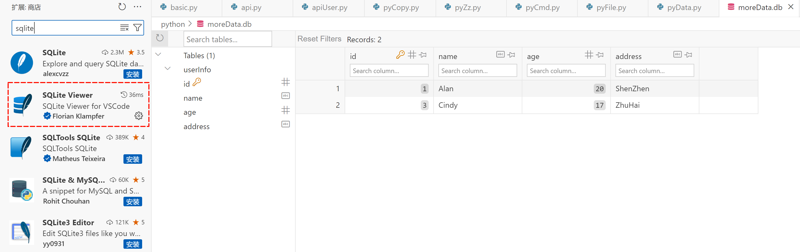
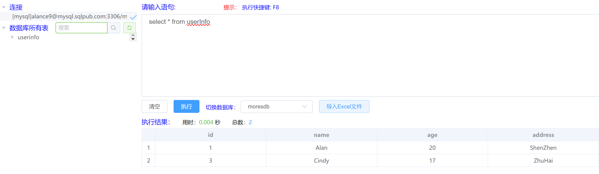

<!-- 数据处理 -->

?> <b> 数据的生命周期： </b><br>
连接数据库，生成游标 <br>
插入、更新、删除数据 <br>
关闭游标，关闭数据连接 <br>

> ### 1. Sqlite 处理数据

?> sqlite3 是 python 内置库 <br>
<br>
sqlite 与其他数据库的区别: <br>
sqlite 是 python 自带的数据库，不需要其他配置，sqlite3 模块驱动 <br>
mysql 需安装配置，pymysql 模块驱动 <br>
oracle 需安装配置，cx_Oracle 模块驱动 <br>
gaussDB 需安装配置，psycopg2 模块驱动 <br>
<br>
以上数据库，处理数据方式大差不差 <br>
Vscode 可视化插件 SQLite Viewer <br>



``` python
import shutil
import sqlite3

try:
    # 连接数据库，不存在数据文件，自动创建
    conn = sqlite3.connect('./python/moreData.db')

    # 创建游标
    cursor = conn.cursor()

    # 删除表
    cursor.execute('drop table if exists userInfo')
    # 提交事务
    conn.commit()
    
    # 创建表
    sql = 'create table userInfo (id int primary key not null,name text not null,age int not null,address char(50))'
    # 执行语句
    cursor.execute(sql)
    # 提交事务
    conn.commit()

    # 插入数据
    sql = "insert into userInfo values ('1','Alan','20','ShenZhen')"
    cursor.execute(sql)
    conn.commit()

    data = [('2', 'Bob', '19', 'GuangZhou'), ('3', 'Cindy', '18', 'ZhuHai')]
    cursor.executemany("insert into userInfo values (?,?,?,?)", data)
    conn.commit()

    # 查询数据
    sql = 'select * from userInfo where name="Cindy"'
    cursor.execute(sql)
    print(cursor.fetchall())

    # 更新数据
    cursor.execute('update userInfo set age=? where name=?', (17, 'Cindy'))
    conn.commit()

    # 删除数据
    cursor.execute(
        'delete from userInfo where name=? and address=?', ('Bob', 'GuangZhou'))
    conn.commit()
    
    # 备份数据库
    shutil.copy2('./python/moreData.db', './python/moreData_backup.db')

except sqlite3.Error:
    # 发生错误，回滚事务
    conn.rollback()
finally:
    # 关闭游标
    cursor.close()
    # 关闭连接
    conn.close()
```

> ### 2. Mysql 处理数据

?> 跳过繁琐的安装配置流程，无需注册，邮箱申请免费云数据库 <br>
云数据库：https://sqlpub.com/#/ <br>
提供服务：最新版 Mysql 8.0 服务；最大 36000 次/小时的请求、同时 30 个连接和 500M 存储空间



``` python
pip install pymysql

import pymysql


try:
    # 连接数据库，ip、用户、密码、端口
    conn = pymysql.connect(host='mysql.sqlpub.com',
                           user='', passwd='', port=3306, db='')
   # 创建游标
    cursor = conn.cursor()

    # 删除表
    cursor.execute('drop table if exists userInfo')
    # 提交事务
    conn.commit()

    # 创建表
    sql = 'create table userInfo (id int primary key not null,name text not null,age int not null,address char(50))'
    # 执行语句
    cursor.execute(sql)
    # 提交事务
    conn.commit()

    # 插入数据
    sql = "insert into userInfo values ('1','Alan','20','ShenZhen')"
    cursor.execute(sql)
    conn.commit()

    data = [('2', 'Bob', '19', 'GuangZhou'), ('3', 'Cindy', '18', 'ZhuHai')]
    sql = "insert into userInfo (id, name, age,address) VALUES (%s, %s, %s,%s)"
    cursor.executemany(sql, data)
    conn.commit()

    # 查询数据
    sql = 'select * from userInfo where name="Cindy"'
    cursor.execute(sql)
    print(cursor.fetchall())

    # 更新数据
    cursor.execute('update userInfo set age=%s where name=%s', (17, 'Cindy'))
    conn.commit()

    # 删除数据
    cursor.execute(
        'delete from userInfo where name=%s and address=%s', ('Bob', 'GuangZhou'))
    conn.commit()

except:
    # 发生错误，回滚事务
    conn.rollback()
finally:
    # 关闭游标
    cursor.close()
    # 关闭连接
    conn.close()
```

> ### 3. Oracle 处理数据

?> 待实践

``` python
pip install cx_Oracle

import cx_Oracle


try:
    # 连接数据库
    conn = cx_Oracle.connect('user/pwd@host/db')

    # 创建游标
    cursor = conn.cursor()

    # 删除表
    cursor.execute('drop table if exists userInfo')
    # 提交事务
    conn.commit()

    # 创建表
    sql = 'create table userInfo (id number primary key,name varchar2(10) not null,age number not null,address varchar2(50))'
    # 执行语句
    cursor.execute(sql)
    # 提交事务
    conn.commit()

    # 插入数据
    sql = "insert into userInfo values (1,'Alan',20,'ShenZhen')"
    cursor.execute(sql)
    conn.commit()

    data = [{'id': 2, 'name': 'Bob', 'age': 19, 'address': 'GuangZhou'}, {
        'id': 3, 'name': 'Cindy', 'age': 18, 'address': 'ZhuHai'}]
    sql = "insert into userInfo values (:id, :name, :age, :address)"
    cursor.executemany(sql, data)
    conn.commit()

    # 查询数据
    sql = 'select * from userInfo where name="Cindy"'
    cursor.execute(sql)
    print(cursor.fetchall())

    # 更新数据
    cursor.execute('update userInfo set age="%s" where name="%s"' %
                   (17, 'Cindy'))
    conn.commit()

    # 删除数据
    cursor.execute(
        'delete from userInfo where name="%s"and address="%s"' % ('Bob', 'GuangZhou'))
    conn.commit()

except:
    # 发生错误，回滚事务
    conn.rollback()
finally:
    # 关闭游标
    cursor.close()
    # 关闭连接
    conn.close()
```

> ### 4. GaussDB 处理数据

?> 待实践，和 mysql（国产数据库模板）差不多，加了一些安全限制

``` python
pip install psycopg2

import psycopg2


try:
    # 连接数据库，ip、用户、密码、端口
    conn = psycopg2.connect(host='mysql.sqlpub.com',
                            user='', password='', port=3306, database='')
   # 创建游标
    cursor = conn.cursor()

    # 删除表
    cursor.execute('drop table if exists userInfo')
    # 提交事务
    conn.commit()

    # 创建表
    sql = 'create table userInfo (id int primary key not null,name text not null,age int not null,address char(50))'
    # 执行语句
    cursor.execute(sql)
    # 提交事务
    conn.commit()

    # 插入数据
    sql = "insert into userInfo values ('1','Alan','20','ShenZhen')"
    cursor.execute(sql)
    conn.commit()

    data = [('2', 'Bob', '19', 'GuangZhou'), ('3', 'Cindy', '18', 'ZhuHai')]
    sql = "insert into userInfo (id, name, age,address) VALUES (%s, %s, %s,%s)"
    cursor.executemany(sql, data)
    conn.commit()

    # 查询数据
    sql = 'select * from userInfo where name="Cindy"'
    cursor.execute(sql)
    print(cursor.fetchall())

    # 更新数据
    cursor.execute('update userInfo set age=%s where name=%s', (17, 'Cindy'))
    conn.commit()

    # 删除数据
    cursor.execute(
        'delete from userInfo where name=%s and address=%s', ('Bob', 'GuangZhou'))
    conn.commit()

except:
    # 发生错误，回滚事务
    conn.rollback()
finally:
    # 关闭游标
    cursor.close()
    # 关闭连接
    conn.close()
```