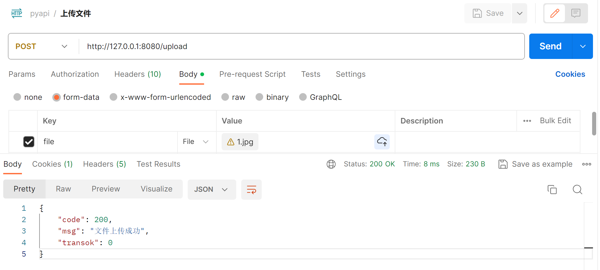
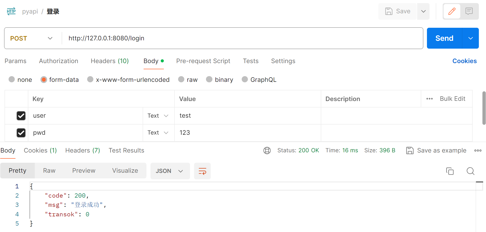
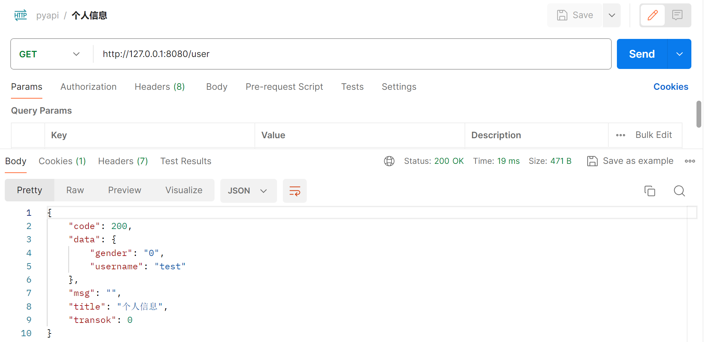
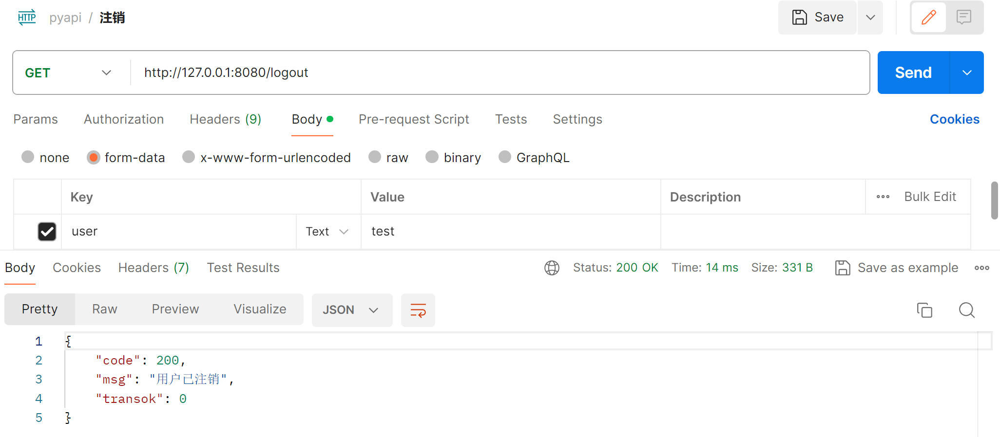

<!-- 请求处理 -->

> ### 1. 请求方式

?> 常用请求方式：get、post <br>
其他请求方式：put、patch、delete、head、options <br>
<br>
python 安装库：pip install requests <br>
<br>
import requests <br>
requests.request('get', url) <br>
requests.get(url, data, params, headers, cookies, files, verify, auth, proxies, timeout) <br>
requests.post(url, data, params, headers, cookies, files, verify, auth, proxies, timeout) <br>


> #### 请求体

``` python
import requests

# GET
# 设置请求头 headers
# 查询参数  params

param = {'s': 'python'}
header = {
    "User-Agent": "Mozilla/5.0 (Windows NT 10.0; Win64; x64) AppleWebKit/537.36 (KHTML, like Gecko) Chrome/54.0.2840.99 Safari/537.36"}

resp = requests.get("https://www.runoob.com/",
                        params=param, headers=header)
print(resp.status_code)   
print(resp.url) 

# POST
# 设置请求头 headers
# 查询参数  params
# 请求参数  data

url = 'http://127.0.0.1:8080/'
req = {'user': 'test', 'pwd': '123'}

resp = requests.post(url=url+'login', data=req)
print(resp.status_code)
print(resp.json())
```
```
200
https://www.runoob.com/?s=python
200
{'code': 200, 'msg': '登录成功', 'transok': 0}
```

> #### 响应体

``` python
import requests


resp = requests.get('http://www.baidu.com')
print('响应状态码：', resp.status_code) # 200-OK、404-Not Found
print('响应方式：', resp.request)
print('响应头：', resp.headers)
print('响应内容：', resp.content, resp.text)
print('响应 URL：', resp.url)
print('响应 Cookies：', tuple(resp.cookies))
print('响应 Encoding：', resp.encoding)
print('响应 是否重定向：', resp.is_redirect)
print('响应状态描述：', resp.reason)
```

```
响应状态码： 200 
响应方式： <PreparedRequest [GET]>
响应头： {'Cache-Control': 'private, no-cache, no-store, proxy-revalidate, no-transform', 'Connection': 'keep-alive', 'Content-Encoding': 'gzip', 'Content-Type': 'text/html', 'Date': 'Sun, 18 Feb 2024 20:17:49 GMT', 'Last-Modified': 'Mon, 23 Jan 2017 13:28:11 GMT', 'Pragma': 'no-cache', 'Server': 'bfe/1.0.8.18', 'Set-Cookie': 'BDORZ=27315; max-age=86400; domain=.baidu.com; path=/', 'Transfer-Encoding': 'chunked'}
响应内容： ...
响应 URL： http://www.baidu.com/
响应 Cookies： (Cookie(version=0, name='BDORZ', value='27315', port=None, port_specified=False, domain='.baidu.com', domain_specified=True, domain_initial_dot=True, path='/', path_specified=True, secure=False, expires=1708374352, discard=False, comment=None, comment_url=None, rest={}, rfc2109=False),)
响应 Encoding： ISO-8859-1
响应 是否重定向： False
响应状态描述： OK
```

> ### 2. 证书验证

?> HTTPS 证书校验报错，urllib3 忽略警告跳过校验： <br>
InsecureRequestWarning: Unverified HTTPS request is being made to host 'www.12306.cn'. <br>
Adding certificate verification is strongly advised.

``` python
import requests
import urllib3


# 跳过证书验证
urllib3.disable_warnings()

response = requests.get('https://www.12306.cn', verify=False)
print(response.status_code) # 200
```

> ### 3. 超时、认证、代理设置

``` python
import requests


# 超时设置
try:
    response = requests.get("http://www.baidu.com", timeout=0.5)
    print(response.status_code)
except:
    print('访问已超时')


# 认证设置
response = requests.get('http://127.0.0.1:8080/', auth=("user", "123"))
print(response.status_code)


# 代理设置
proxies = {
    "http": url1,
    "https": url2,
}

response = requests.get("https://www.taobao.com", proxies=proxies)
print(response.status_code)
```

> ### 4. 文件查看、上传、下载

***

> #### 查看文件


``` python
import requests


# 查看文件
url = 'http://127.0.0.1:8080/'
file = 'pic.jpg'

resp = requests.get(url=url + 'show/' + file)
print(resp.status_code)
```

***

> #### 上传文件



``` python
import requests


url = 'http://127.0.0.1:8080/'
path = f'C:/Users/Z/Pictures/1.jpg'

# 上传文件
req = {'file': ('file.jpg', open(path, 'rb'), 'image/jpg')}
resp = requests.post(url=url+'upload', files=req)
print(resp.status_code)
print(resp.json())
print(resp.headers)
print(resp.url)
```
```
200
{'code': 200, 'msg': '文件上传成功', 'transok': 0}
{'Server': 'Werkzeug/3.0.1 Python/3.9.13', 'Date': 'Sun, 18 Feb 2024 22:52:39 GMT', 'Content-Type': 'application/json', 'Content-Length': '65', 'Connection': 'close'}
http://127.0.0.1:8080/upload
```

***

> #### 下载文件


``` python
import requests
import os
import uuid


url = 'http://127.0.0.1:8080/'
path = fr'./autoApi/static/downloadTo/'
file = 'pic.jpg'

# 获取文件
resp = requests.get(url=url+'download/'+file)
print(resp.status_code)
print(resp.url)

# 保存文件
if not os.path.exists(path):
    os.makedirs(path)
file = os.path.join(path, str(uuid.uuid4()) + ".jpg")
with open(file, 'wb') as f:
    f.write(resp.content)

if os.path.exists(file):
    print('下载文件成功')
```
```
200
http://127.0.0.1:8080/download/pic.jpg
下载文件成功
```


> ### 5. 模拟登录

?> 模拟登录、注销、权限受控的场景：处于登录状态，才能访问个人信息 <br>
<br>
请求接口： <br>
登录：http://127.0.0.1:8080/login <br>
注销：http://127.0.0.1:8080/logout <br>
访问个人信息：http://127.0.0.1:8080/user <br>
<br>
账号密码：test / 123

***

> #### 模拟登录



``` python
import requests


# 模拟登录
req = {'user': 'test', 'pwd': '123'}
resp = requests.post(url=url+'login', data=req)
print(resp.status_code)
print(resp.json())
```
```
200
{'code': 200, 'msg': '登录成功', 'transok': 0}
```

***

> #### 模拟登录后，访问个人信息



``` python
import requests


# 模拟登录后，访问个人信息
req = {'user': 'test', 'pwd': '123'}
resp = requests.post(url=url+'login', data=req)
print(resp.status_code)
print(resp.json())

resp = requests.get(url=url+'user')
print(resp.status_code)
print(resp.json())
```
```
200
{'code': 200, 'msg': '登录成功', 'transok': 0}
200
{'code': 203, 'msg': '用户未登录', 'transok': 1}   
```

***
> #### 模拟登录后，注销




``` python
import requests


# 模拟注销
req = {'user': 'test', 'pwd': '123'}
resp = requests.post(url=url+'login', data=req)
print(resp.status_code)
print(resp.json())

req = {'user': 'test'}
resp = requests.get(url=url+'logout', data=req)
print(resp.status_code)
print(resp.json())
```
```
200
{'code': 200, 'msg': '登录成功', 'transok': 0}
200
{'code': 203, 'msg': '用户未登录', 'transok': 1} 
```

!> 由此发现一个问题： <br>
postman 测试登录、注销、个人信息接口，是正常保留登录状态的 <br>
requests 则没有保留登录状态，导致测试注销、个人信息，一直处于未登录状态


> ### 6. 保持会话

?> requests 请求，不会维持会话状态，每次请求，相当于一次会话的开始和结束  <br>
session 请求，可以维持会话状态，下一次请求依然能获取上一次的 session / cookies

``` python
import requests


# 保持会话
session = requests.Session()

# 模拟登录后，访问个人信息
req = {'user': 'test', 'pwd': '123'}
resp = requests.post(url=url+'login', data=req)
print(resp.status_code)
print(resp.json())

resp = requests.get(url=url+'user')
print(resp.status_code)
print(resp.json())

# 模拟登录注销后，访问个人信息
req = {'user': 'test', 'pwd': '123'}
resp = requests.post(url=url+'login', data=req)
print(resp.status_code)
print(resp.json())

req = {'user': 'test'}
resp = requests.get(url=url+'logout', data=req)
print(resp.status_code)
print(resp.json())

resp = requests.get(url=url+'user')
print(resp.status_code)
print(resp.json())
```
```
200
{'code': 200, 'msg': '登录成功', 'transok': 0}
200
{'code': 200, 'data': {'gender': '0', 'username': 'test'}, 'msg': '', 'title': '个人信息', 'transok': 0}       
 
200
{'code': 200, 'msg': '登录成功', 'transok': 0}
200
{'code': 200, 'msg': '用户已注销', 'transok': 0}        
200
{'code': 203, 'msg': '用户未登录', 'transok': 1}  
```