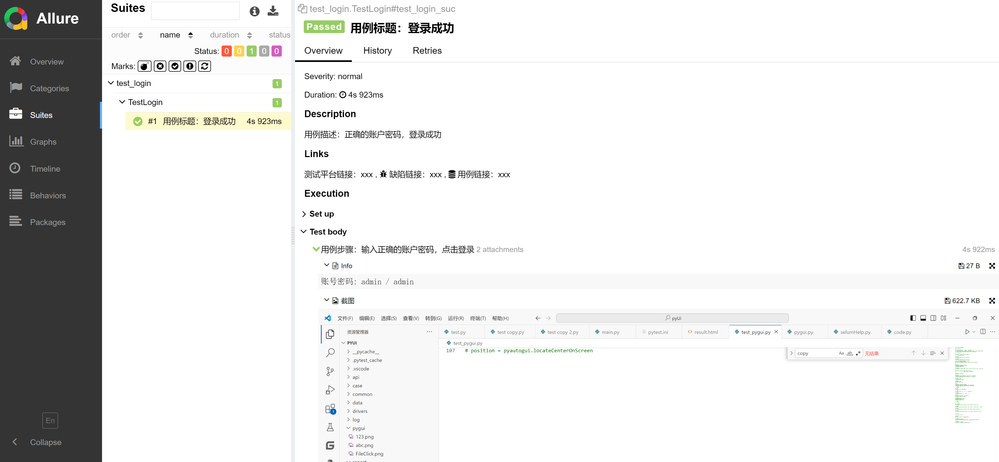

<!-- allure -->

> ### 1. Allure 入门

?> Allure 相比 pytest-html，支持更多模板自定义，提供细致美观的测试报告。 <br>
<br>
Allure 运行前提： <br>
下载配置 [Java JDK](https://www.oracle.com/java) <br>
下载配置 [Allure 命令行工具](https://github.com/allure-framework/allure2/releases)  <br>


> ### 2. 示例参考

``` python
# pip install allure-pytest
# test_login.py

from loginHelp import *
import pytest
import allure


base_url = '127.0.0.1:8080'

@allure.epic('项目 test')
@allure.feature('登录模块')
class TestLogin():

    def setup_class(self):
        self.driver = open()

    def teardown_class(self):
        self.driver.close()

    """ 用例等级：blocker、critical、normal、minor、trivial """
    
    @allure.title('用例标题：登录成功')
    @allure.severity('normal')
    @allure.description('用例描述：正确的账户密码，登录成功')
    @allure.step('用例步骤：输入正确的账户密码，点击登录')
    @allure.testcase(base_url, name='用例链接：xxx')
    @allure.issue(base_url, name='缺陷链接：xxx')
    @allure.link(base_url, name='测试平台链接：xxx')
    @allure.story('用例故事：很久很久以前...')
    def test_login_suc(self):
        """ 登录成功 """
        # 文本、图片附件
        allure.attach('账号密码: admin / admin', 'Info',
                      allure.attachment_type.TEXT)
        allure.attach.file('./pygui/abc.png', '截图',
                           allure.attachment_type.PNG, extension="png")
        login(self.driver)
```
``` python
# main.py

import os
import sys
import pytest


if __name__ == '__main__':

    # allure 源数据
    path = 'allureData'
    os.makedirs(path, exist_ok=True)

    # allure 测试报告
    report_path = 'allureReport'
    os.makedirs(report_path, exist_ok=True)

    # 生成数据源
    args_list = ['test_login.py', '-vs',
                 '--disable-warnings', '--alluredir', path]
    code = pytest.main(args_list)

    # 数据源生成测试报告
    cmd = f'allure generate {path} -o {report_path} -c'
    os.system(cmd)

    print(f'案例执行完成，退出码：{code}')
    sys.exit(code)
```
``` 
test_login.py::TestLogin::test_login_suc 

验证码：V9AM 
2024-03-04 07:43:44,004 selumHelp.py waitForElement [line- 160] INFO 等待超时，元素不存在 5s
2024-03-04 07:43:45,020 loginHelp.py login [line- 43] INFO 登录成功
```


> ### 3. 测试报告

?> 生成源数据：pytest .\test_login.py -vs --disable-warnings --alluredir=./allureData <br>
源数据生成测试报告：allure generate ./allureData -o .\allureReport\ <br>
运行测试报告：allure open .\allureReport\

Allure 测试报告：<a href='../_media/allureReport/index.html' target='blank'>Click Here</a>

