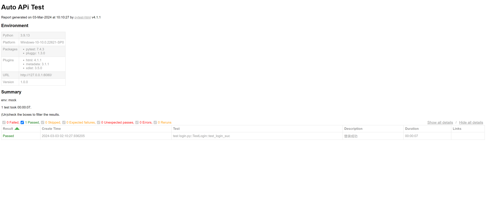

<!-- selenium -->

> ### 1. selenium 4.0

?> selenium 支持主流浏览器的 UI 自动化（Chrome、FireFox、IE） <br>
不同的浏览器有各自特定的驱动，驱动作为桥梁，帮助 selenium 向浏览器传达指令，操作页面元素

``` python
pip install selenium==3.141.0

# 查看浏览器版本，下载对应的驱动（chromedriver - win64）
# 放到执行程序的同级目录，免去配置环境变量
Chome 驱动下载：https://googlechromelabs.github.io/chrome-for-testing/

浏览器输入，快速查看根目录：chrome://version/
可执行文件路径	C:\Program Files\Google\Chrome\Application\chrome.exe


# selenium 4.0 新增了浏览器驱动管理器，免去下载配置
pip install webdriver-manager

# 自动匹配当前浏览器的版本
pip install chromedriver_autoinstaller

from selenium import webdriver
from selenium.webdriver.chrome.service import Service as ChromeServi
from webdriver_manager.chrome import ChromeDriverManager
service = ChromeService(executable_path=ChromeDriverManager().install())
driver = webdriver.Chrome(service=service)

OR

# 传统下载配置
from selenium import webdriver
from selenium.webdriver.chrome.service import Service as ChromeService
options = webdriver.ChromeOptions()
service = ChromeService(executable_path=CHROMEDRIVER_PATH)
driver = webdriver.Chrome(service=service, options=options)


# 相比 selenium 3.0，简化了部分语法
driver = webdriver.Chrome(chrome_options=options)
driver.driver.find_element_by_xx()

driver = webdriver.Chrome(service=service, options=options)
driver.find_element(By.XX,'')
driver.find_elements(By.XX,'')

# 新增元素等待方法
from selenium.webdriver.support.ui import WebDriverWait
errors = [NoSuchElementException, ElementNotInteractableException]
wait = WebDriverWait(driver, timeout=2, poll_frequency=.2, ignored_exceptions=errors)
wait.until(lambda d : revealed.send_keys("Displayed") or True)

# selenium 4 安装版本过高时，启动浏览器会自动关闭
# 解决方法，卸载后重装低版本
pip uninstall selenium
pip install selenium==4.1.1
```


> ### 2. 参数配置


``` python
from selenium import webdriver
from selenium.webdriver.common.desired_capabilities import DesiredCapabilities


option = webdriver.ChromeOptions()

option.add_argument('--headless')

# 忽略证书
option.add_argument('--ignore-certificate-errors')

# 防止打印无用的日志
option.add_experimental_option(
    "excludeSwitches", ['enable-automation', 'enable-logging'])

# 禁用 保存密码 弹出窗口
option.add_experimental_option("prefs", {
                                "credentials_enable_service": False, "profile.password_manager_enabled": False})

# 禁止显示 请停用以开发者
option.add_experimental_option('useAutomationExtension', False)

# 禁止显示 Chrome正受到自动化软件的控制
option.add_experimental_option("excludeSwitches", ['enable-automation'])

# 不等待界面加载完成，直接匹配元素，减少耗时
desired_capabilities = DesiredCapabilities.CHROME
desired_capabilities["pageLoadStrategy"] = "none"

driver = webdriver.Chrome(options=option)

# 窗口最大化
driver.maximize_window()

# 访问网址
driver.get("https://d2-admin.netlify.app/#/login")

# 关闭当前窗口
driver.close()

# 退出驱动，退出所有窗口
driver.quit()
```
```
```

> ### 3. 元素定位

?> 八大元素：id、name、xpath、css_selector、link_text、partial_link_text、class_name、tag_name <br>
<br>
xpath 有相对路径、绝对路径，相对路径可以这样定位：".//标签名[@属性名=属性值]"，如 './/input[@type="checkbox"]' <br>
link_text 精准文字定位、partial_link_text 模糊文字定位 <br>
<br>
常用 id、name、xpath、class_name

``` python
driver.find_element(By.ID, name)
driver.find_element(By.NAME, name)
driver.find_element(By.XPATH, name)
driver.find_element(By.CLASS_NAME, name)
driver.find_element(By.LINK_TEXT, name)
driver.find_element(By.PARTIAL_LINK_TEXT, name)
driver.find_element(By.CSS_SELECTOR, name)
driver.find_element(By.TAG_NAME, name)
```

> ### 4. 元素交互

| 元素操作 | |
| -- | -- |
| click | 点击 |
| clear | 清除 |
| send_keys | 输入文本 |
| text | 文本 |
| screenshot | 截图 |
| execute_script | 执行 js |

``` python
driver.find_element(By.ID, name)
driver.find_element(By.ID, name).click()
driver.find_element(By.ID, name).clear()
driver.find_element(By.ID, name).send_keys(value)
driver.find_element(By.ID, name).text
driver.find_element(By.ID, name).screenshot(path)
driver.execute_script(js)
```

***

> ##### 滚动条

``` python
# 滚动条，跳转到底部
js = "window.scrollTo(0, document.body.scrollHeight)"
driver.execute_script(js)

# 滚动条，跳转到顶部
js = "window.scrollTo(0, 0)"
driver.execute_script(js)

# 滚动条，水平跳转
js = "window.scrollTo(x, y)"
driver.execute_script(js)

# x 水平距离，y 垂直距离
```

***

> ##### 下拉框

``` python
from selenium.webdriver.support.select import Select

# 索引定位
Select(driver.find_element(By.ID, name)).select_by_index(index)

# 属性值定位
Select(driver.find_element(By.ID, name)).select_by_value(value)

# 文本定位
Select(driver.find_element(By.ID, name)).select_by_visible_text(text)   
```

***

> ##### iframe 框架

``` python
# # iframe，进入框架
driver.switch_to.frame(0)
driver.switch_to.frame(id)
driver.switch_to.frame(name)

# # iframe，退出框架
driver.switch_to.default_content()
driver.switch_to.parent_frame()
```

***

> ##### alert 弹窗

``` python
切焦点，进入弹出框
旧：driver.switch_to_alert()
新：driver.switch_to.alert()
	
# 取消
driver.switch_to.alert().dismiss()
	
# 确认
driver.switch_to.alert().accept()
	
# 弹窗文本
driver.switch_to.alert().text
```

> ### 5. 键盘交互

``` python

# 全选
driver.find_element(By.ID, name).send_keys(Keys.CONTROL,'a')

# 复制
driver.find_element(By.ID, name).send_keys(Keys.CONTROL,'c')

# 粘贴
driver.find_element(By.ID, name).send_keys(Keys.CONTROL,'v')

# 剪切
driver.find_element(By.ID, name).send_keys(Keys.CONTROL,'x')

# 回车
driver.find_element(By.ID, name).send_keys(Keys.Back_Space)
```


> ### 6. 鼠标交互

``` python
from selenium.webdriver import ActionChains

# 双击
ActionChains(driver).double_click(element).perform()

# 右键
ActionChains(driver).content_click(element).perform()

# 悬浮
ActionChains(driver).move_to_element(element).perform()
```


> ### 7. 窗口交互

``` python
# 获取所有窗口唯一标识（句柄）
handlers = driver.window_handles

# 跳转窗口，初始为0，最新为-1
旧：driver.switch_to_window()
新：driver.switch_to.window()
# 跳转原始窗口
driver.switch_to.window(handlers[0])
# 跳转最新窗口
driver.switch_to.window(handlers[-1])

# 关闭当前窗口
driver.close()
# 关闭所有窗口
driver.quit()

# 打开新窗口
js = f'window.open("{url}");'
driver.execute_script(js)
handlers = driver.window_handles
driver.switch_to.window(handlers[-1])

# 前进
driver.forward()
# 后退
driver.back()
# 刷新
driver.refresh()
```


> ### 8. 休眠等待

``` python
# 强制等待，无条件
import time
time.sleep(s) 

# 隐式等待，全局设置最长等待时间
driver.implicitly_wait(s)

# 显示等待，满足条件执行下一步，否则抛出异常
from selenium.webdriver.support.ui import WebDriverWait
WebDriverWait(driver, timeout=2, poll_frequency=.2, ignored_exceptions=errors).until(lambda d : revealed.send_keys("Displayed") or True)

# 自定义查询次数，每秒查询一次
def waitForElement(func, driver, element, timeout=ts):
    # selenium 3.0 适用
    # 每隔 1s 查询一次，等待元素出现
    i = 0
    while i < timeout:
        sleep(1)  # import time
        i = i+1
        flag = func(driver, element)
        if flag:
            return True
        else:
            logger.info(f'等待超时，元素不存在 {timeout}s')

def classRun(driver, name):
    # 查询一次元素
    try:
        driver.find_element(By.CLASS_NAME, name)
        return True
    except:
        return False

def classIsExists(driver, name, timeout=ts):
    # 调用自定义等待，检查元素是否存在
    result = waitForElement(classRun, driver, name, timeout)
    return result
```

> ### 9. 二次封装

?> 重新封装一次 selenium，简化语法。 <br>
二次封装功能模块，便于组装场景，使测试代码更干净利落。 <br>
<br>
Message: invalid selector: An invalid or illegal selector was specified <br>
非唯一元素，换成其他类型匹配 <br>
<br>
示例：正确账户密码，登录成功 <br>
https://d2-admin.netlify.app/#/login


``` python
# 源代码
# test_login.py

import os
import time
from selenium import webdriver
from selenium.webdriver.common.by import By
from common.code import getCode
from common.myLogger import logger
from selenium.webdriver.common.desired_capabilities import DesiredCapabilities


option = webdriver.ChromeOptions()

# 忽略证书
option.add_argument('--ignore-certificate-errors')

# 防止打印无用的日志
option.add_experimental_option(
    "excludeSwitches", ['enable-automation', 'enable-logging'])

# 禁用 保存密码 弹出窗口
option.add_experimental_option("prefs", {
                               "credentials_enable_service": False, "profile.password_manager_enabled": False})

# 禁止显示 请停用以开发者
option.add_experimental_option('useAutomationExtension',False)

# 禁止显示 Chrome正受到自动化软件的控制
option.add_experimental_option("excludeSwitches",['enable-automation'])

# 无头模式
option.add_argument('--headless')

# 不等待界面加载完成，直接匹配元素，减少耗时
desired_capabilities = DesiredCapabilities.CHROME
desired_capabilities["pageLoadStrategy"] = "none"

driver = webdriver.Chrome(options=option)

# 窗口最大化
driver.maximize_window()

# 访问网址
driver.get("https://d2-admin.netlify.app/#/login")


""" 登录 """


# 输入账号
driver.find_element(
    By.XPATH, '//*[@id="app"]/div/div[3]/div/div[2]/div/div/div/form/div[1]/div/div/input').click()
driver.find_element(
    By.XPATH, '//*[@id="app"]/div/div[3]/div/div[2]/div/div/div/form/div[1]/div/div/input').clear()
driver.find_element(
    By.XPATH, '//*[@id="app"]/div/div[3]/div/div[2]/div/div/div/form/div[1]/div/div/input').send_keys('admin')

# 输入密码
driver.find_element(
    By.XPATH, '//*[@id="app"]/div/div[3]/div/div[2]/div/div/div/form/div[2]/div/div/input').click()
driver.find_element(
    By.XPATH, '//*[@id="app"]/div/div[3]/div/div[2]/div/div/div/form/div[2]/div/div/input').clear()
driver.find_element(
    By.XPATH, '//*[@id="app"]/div/div[3]/div/div[2]/div/div/div/form/div[2]/div/div/input').send_keys('admin')

# 保存验证码
os.makedirs('resource', exist_ok=True)
driver.find_element(
    By.CLASS_NAME, 'login-code').screenshot("./resource/login.png")
time.sleep(2)  # import time

# 识别验证码
code = getCode()
time.sleep(1)
driver.find_element(
    By.XPATH, '//*[@id="app"]/div/div[3]/div/div[2]/div/div/div/form/div[3]/div/div/input').click()
driver.find_element(
    By.XPATH, '//*[@id="app"]/div/div[3]/div/div[2]/div/div/div/form/div[3]/div/div/input').clear()
driver.find_element(
    By.XPATH, '//*[@id="app"]/div/div[3]/div/div[2]/div/div/div/form/div[3]/div/div/input').send_keys(code)

# 登录
driver.find_element(
    By.XPATH, '//*[@id="app"]/div/div[3]/div/div[2]/div/div/div/form/button').click()
time.sleep(5)

# 登录成功
text = driver.find_element(
    By.XPATH, '/html/body/div[1]/div/div[2]/div[2]/div[2]/div/div[2]/div/div[1]/div/div/p[2]')
logger.info('登录成功')


# 关闭当前窗口
driver.close()

# 退出驱动，退出所有窗口
driver.quit()
```

***

> #### 重新封装，简化语法

``` python
# selumHelp.py

import pytesseract
import re
import numpy
import cv2
import os
import time
from selenium import webdriver
from selenium.webdriver.common.by import By
from selenium.webdriver.common.desired_capabilities import DesiredCapabilities
from common.myLogger import logger
from selenium.webdriver.support.wait import WebDriverWait


ts = 3
base_url = "https://d2-admin.netlify.app/#/login"


def sleep(timeout=ts):
    time.sleep(timeout)


def openChrome(url=base_url, max=True, ignore_pic=False):

    option = webdriver.ChromeOptions()

    if ignore_pic:
        # 无头模式
        option.add_argument('--headless')

    # 忽略证书
    option.add_argument('--ignore-certificate-errors')

    # 防止打印无用的日志
    option.add_experimental_option(
        "excludeSwitches", ['enable-automation', 'enable-logging'])

    # 禁用 保存密码 弹出窗口
    option.add_experimental_option("prefs", {
                                   "credentials_enable_service": False, "profile.password_manager_enabled": False})

    # 禁止显示 请停用以开发者
    option.add_experimental_option('useAutomationExtension', False)

    # 禁止显示 Chrome正受到自动化软件的控制
    option.add_experimental_option("excludeSwitches", ['enable-automation'])

    # 不等待界面加载完成，直接匹配元素，减少耗时
    desired_capabilities = DesiredCapabilities.CHROME
    desired_capabilities["pageLoadStrategy"] = "none"

    driver = webdriver.Chrome(options=option)
    # 访问网址
    driver.get(url)
    if max:
        # 窗口最大化
        driver.maximize_window()
    return driver


""" selenium 4.0 适用 """

""" 封装 selenium """

""" CLASS """


def waitForElement(func, driver, element, timeout=ts):
    # selenium 3.0 适用
    # 每隔 1s 查询一次，等待元素出现
    i = 0
    while i < timeout:
        sleep(1)  # import time
        i = i+1
        flag = func(driver, element)
        if flag:
            return True
        else:
            logger.info(f'等待超时，元素不存在 {timeout}s')


def classRun(driver, name):
    # 查询一次元素
    try:
        driver.find_element(By.CLASS_NAME, name)
        return True
    except:
        return False


def classIsExists(driver, name, timeout=ts):
    # 检查元素是否存在
    result = waitForElement(classRun, driver, name, timeout)
    return result


def class_name(driver, name, timeout=ts):
    # 返回元素
    waitForElement(classRun, driver, name, timeout)
    element = driver.find_element(By.CLASS_NAME, name)
    return element


def classClick(driver, name, timeout=ts):
    # 点击元素
    driver.find_element(By.CLASS_NAME, name).click()


def classClear(driver, name, timeout=ts):
    # 清理元素
    driver.find_element(By.CLASS_NAME, name).clear()


def classInput(driver, name, value, timeout=ts):
    # 输入内容
    classClick(driver, name, timeout)
    classClear(driver, name, timeout)
    driver.find_element(By.CLASS_NAME, name).sendkeys(value)


def classText(driver, name, timeout=ts):
    # 元素内容
    data = driver.find_element(By.CLASS_NAME, name).text
    return data


qr = "./resource/login.png"


def classPic(driver, name, path=qr, timeout=ts):
    # 保存元素图片，如验证码
    os.makedirs('resource', exist_ok=True)
    driver.find_element(By.CLASS_NAME, name).screenshot(path)
    sleep(2)


""" XPATH """


def xpathRun(driver, name):
    # 查询一次元素
    try:
        driver.find_element(By.XPATH, name)
        return True
    except:
        return False


def xpathIsExists(driver, name, timeout=ts):
    # 检查元素是否存在
    result = waitForElement(xpathRun, driver, name, timeout)
    return result


def xpath(driver, name, timeout=ts):
    # 返回元素
    waitForElement(xpathRun, driver, name, timeout)
    element = driver.find_element(By.XPATH, name)
    return element


def xpathClick(driver, name, timeout=ts):
    # 点击元素
    driver.find_element(By.XPATH, name).click()


def xpathClear(driver, name, timeout=ts):
    # 清理元素
    driver.find_element(By.XPATH, name).clear()


def xpathInput(driver, name, value, timeout=ts):
    # 输入内容
    xpathClick(driver, name, timeout)
    xpathClear(driver, name, timeout)
    driver.find_element(By.XPATH, name).send_keys(value)


def xpathText(driver, name, timeout=ts):
    # 元素内容
    data = driver.find_element(By.XPATH, name).text
    return data


def xpathPic(driver, name, path=qr, timeout=ts):
    # 保存元素图片，如验证码
    os.makedirs('resource', exist_ok=True)
    driver.find_element(By.XPATH, name).screenshot(path)
    sleep(2)


""" 识别验证码 """


def salt(img, n):
    # 椒盐噪点
    for k in range(n):
        i = int(numpy .random.random() * img.shape[1])
        j = int(numpy .random.random() * img.shape[0])
        if img.ndim == 2:
            img[j, i] = 255
        elif img.ndim == 3:
            img[j, i, 0] = 255
            img[j, i, 1] = 255
            img[j, i, 2] = 255
        return img


def getCode(path=qr):

    img = cv2.imread(path)

    # 按比例放大图片
    img = cv2.resize(img, None, fx=6, fy=6, interpolation=cv2.INTER_CUBIC)

    # 自定义模糊
    # 不模糊的话，4 会被识别成 d 或 k
    kernel = numpy.ones([5, 5], numpy.float32)/25
    img = cv2.filter2D(img, -1, kernel)

    img = salt(img, 500)
    img = cv2.medianBlur(img, 5)

    # 双边滤波
    img = cv2.bilateralFilter(img, 0, 100, 5)
    # 均值迁移
    img = cv2.pyrMeanShiftFiltering(img, 10, 50)

    # 二值化
    img = cv2.cvtColor(img, cv2.COLOR_BGR2GRAY)
    ret, binary = cv2.threshold(img, 190, 255, cv2.THRESH_BINARY_INV)

    code = pytesseract.image_to_string(img, lang='chi_sim')
    code = re.sub('[^A-Za-z0-9]+', ' ', code)
    print('验证码：' + code)
    return code
```

``` python
# test_login.py

from common.myLogger import logger
from selenium.webdriver.common.desired_capabilities import DesiredCapabilities
from common.selumHelp import (classPic, getCode, openChrome, sleep, xpathClick, xpathInput,
                              xpathIsExists)

driver = openChrome()

""" 登录 """

# 输入账号
xpathInput(
    driver, '//*[@id="app"]/div/div[3]/div/div[2]/div/div/div/form/div[1]/div/div/input', 'admin')

# 输入密码
xpathInput(
    driver, '//*[@id="app"]/div/div[3]/div/div[2]/div/div/div/form/div[2]/div/div/input', 'admin')

# 保存验证码
classPic(driver, 'login-code')

# 识别验证码
code = getCode()
xpathInput(
    driver, '//*[@id="app"]/div/div[3]/div/div[2]/div/div/div/form/div[3]/div/div/input', code)
sleep(1)

# 登录
xpathClick(
    driver, '//*[@id="app"]/div/div[3]/div/div[2]/div/div/div/form/button')


# 登录成功，检查元素
flag = xpathIsExists(
    driver, '/html/body/div[1]/div/div[2]/div[2]/div[2]/div/div[2]/div/div[1]/div/div/p[2]', 5)
assert flag
logger.info('登录成功')

# 关闭当前窗口
driver.close()

# 退出驱动，退出所有窗口
driver.quit()
```

***

> #### 二次封装，简化功能，组装场景

``` python
# loginHelp.py

from common.code import getCode
from common.myLogger import logger
from common.selumHelp import classPic, openChrome, sleep, xpathClick, xpathInput, xpathIsExists


base_url = "https://d2-admin.netlify.app/#/login"
user = 'admin'
pwd = 'admin'

def open(url=base_url, max=True, ignore_pic=False):
    # 启动浏览器，访问网址
    driver = openChrome(url, max, ignore_pic)
    return driver


def close(driver):
    # 退出驱动，退出所有窗口
    driver.quit()


def login(driver, user=user, pwd=pwd, expect=True):
    
    """ 登录 """

    # 输入账号
    xpathInput(
        driver, '//*[@id="app"]/div/div[3]/div/div[2]/div/div/div/form/div[1]/div/div/input', user)
    # 输入密码
    xpathInput(
        driver, '//*[@id="app"]/div/div[3]/div/div[2]/div/div/div/form/div[2]/div/div/input', pwd)
    # 保存验证码
    classPic(driver, 'login-code')
    # 识别验证码
    code = getCode()
    xpathInput(
        driver, '//*[@id="app"]/div/div[3]/div/div[2]/div/div/div/form/div[3]/div/div/input', code)
    sleep(1)
    # 登录
    xpathClick(
        driver, '//*[@id="app"]/div/div[3]/div/div[2]/div/div/div/form/button')
    # 登录成功，检查元素
    flag = xpathIsExists(
        driver, '/html/body/div[1]/div/div[2]/div[2]/div[2]/div/div[2]/div/div[1]/div/div/p[2]', 5)
    assert flag == expect
    logger.info('登录成功')
```

``` python
# test_login.py

from loginHelp import *
import pytest

class TestLogin():
    
    def setup_class(self):
        self.driver = open()

    def teardown_class(self):
        self.driver.close()
        
    def test_login_suc(self):
        """ 登录成功 """
        login(self.driver)
```

> ### 10. 运行结果

?> pytest 生成测试报告和日志

```
pytest test_login.py --html=./report/result.html --self-contained-html -vs

Log_2024-03-03 101020.log
2024-03-03 10:10:27,851 loginHelp.py login [line- 43] INFO 登录成功

result.html
```

